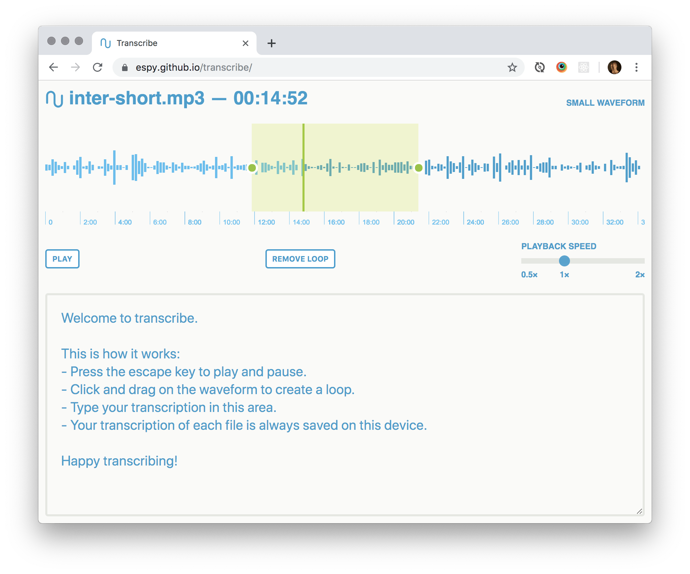

# Transcribe ✍️

A simple, no-nonsense [online tool](https://espy.github.io/transcribe/) that helps you transcribe audio files. [Run it on your own machine](#development-and-running-locally-%F0%9F%9B%A0%EF%B8%8F) if you like.

## Yes ✅

- Multiple formats (wav, mp3, m4a, flac, possible more).
- Play/pause with <key>esc</key> so you never have to take your hands off the keyboard to control the audio playback.
- Loop tricky regions.
- Slow down the audio if it’s difficult to understand.
- Speed up the audio if the speakers are too slow.
- Transcriptions for each file are stored in-browser, on that one device. If you come back and drag in the same file again, your transcription will appear again.
- Saves your work in-browser on every keystroke.

## No 💥

- No signup or login.
- No file management.
- No logs.
- No tracking.
- No backend. I don’t get your audio or your transcriptions.
- No business model.
- No guarantees. Save your work.

## Development and running locally 🛠️

Just run a http server in the project root. If you’re on a Mac, you can just do `python -m SimpleHTTPServer`. Alternatively, use this [super-nifty autorefreshing static server](https://github.com/tapio/live-server) from npm: `npm install -g live-server`, then `live-server`.

There’s no package management, no build pipeline, no css compilation, no autoprefixing etc. Some stuff comes from CDNs. This will probably improve so you can use this offline in the future.
